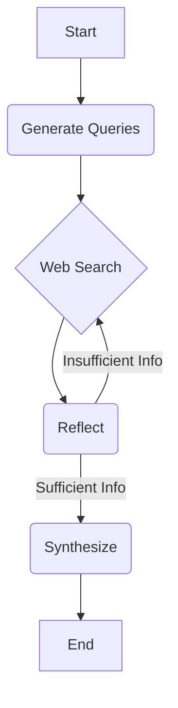

# Research LLM Agent

This project is a command-line research agent built with Python, LangChain, and LangGraph. It takes a user's question, performs web searches, reflects on the results, and synthesizes a concise answer with citations.

This project was built to satisfy the requirements of the take-home assignment described in `../Interview coding question.pdf`.

---

## Architecture

The agent is implemented as a cyclic graph using LangGraph. The flow is as follows:

1.  **Generate Queries**: The user's question is passed to an LLM to generate a set of initial search queries.
2.  **Web Search**: The queries are executed concurrently using the Tavily Search API (or a mock tool if the API key is not provided).
3.  **Reflect**: The search results are passed to an LLM to determine if they are sufficient to answer the question. 
    - If **yes**, the process moves to the `Synthesize` step.
    - If **no**, the LLM generates new, refined queries, and the process loops back to the `Web Search` step. This loop can run for a maximum of two cycles.
4.  **Synthesize**: The final collection of documents is passed to an LLM to generate a concise, cited answer.

### Visual Flow



---

## How to Run

### Prerequisites

- Docker and Docker Compose
- Git

### 1. Clone the Repository

```bash
git clone <repository-url>
cd llm-research-agent
```

### 2. Set Up Environment Variables

Create a `.env` file in the root of the `llm-research-agent` directory and add your API keys. You only need to provide one of the LLM provider keys.

```
# .env

# LLM Provider API Keys
# The agent will use the one that is available.

# For Google Generative AI
GOOGLE_API_KEY="your-google-api-key"

# For OpenAI
# OPENAI_API_KEY="sk-..."

# Tavily Search API Key (optional, uses mock if not present)
TAVILY_API_KEY="your-tavily-api-key"
```

### 3. Run the Agent

Use `docker-compose` to build and run the agent. The question is passed as a command-line argument.

```bash
docker compose run --rm agent "Who won the 2022 FIFA World Cup?"
```

**Example Output:**

```json
{
  "answer": "Argentina won the 2022 FIFA World Cup, defeating France on penalties after a 3-3 draw in extra time. [1]",
  "citations": [
    {
      "id": 1,
      "url": "https://www.fifa.com/worldcup/news/argentina-win",
      "title": "Argentina win World Cup 2022"
    }
  ]
}
```

### 4. Run Tests

To ensure everything is working as expected, you can run the test suite. The tests are designed to run offline using mocks.

First, build the image, then override the entrypoint to run `pytest`.

```bash
docker compose build
docker compose run --rm --entrypoint "pytest -q" agent
```